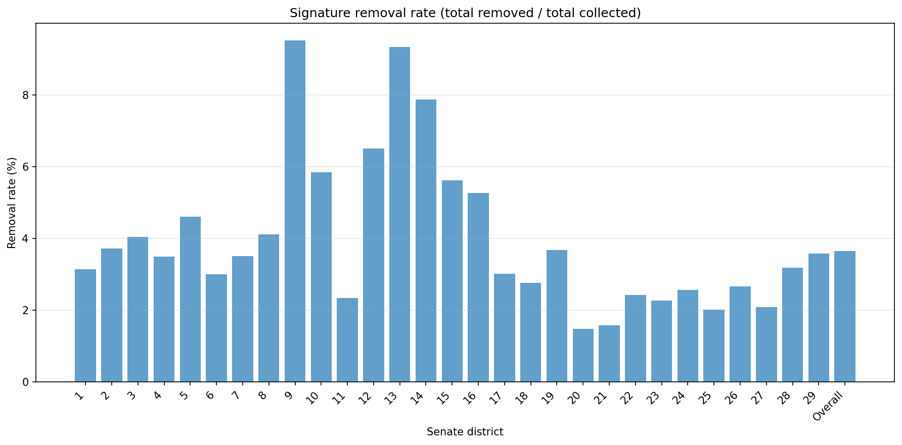
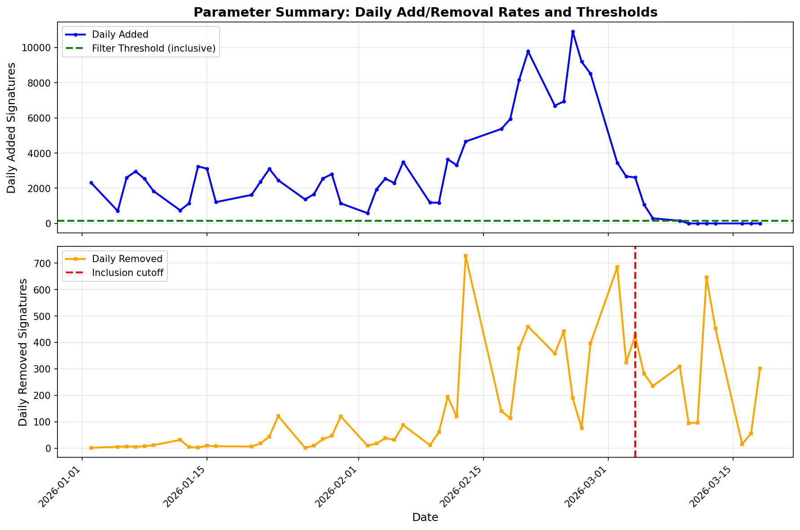
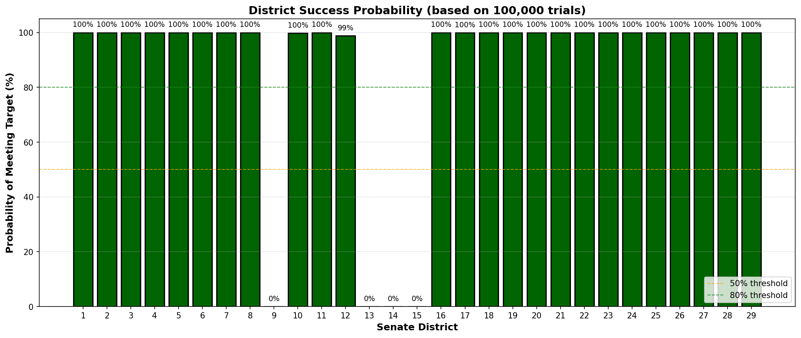
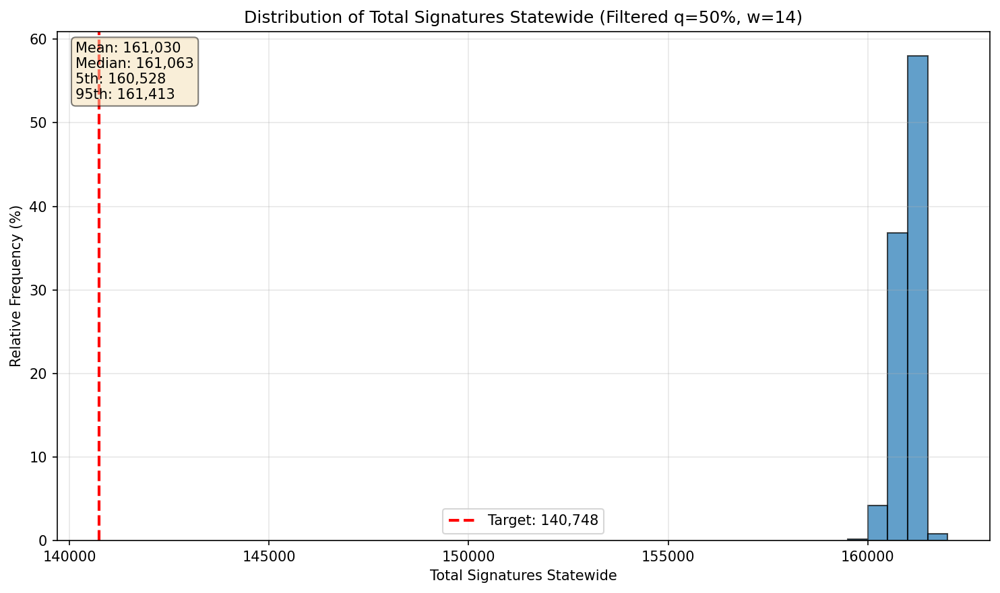
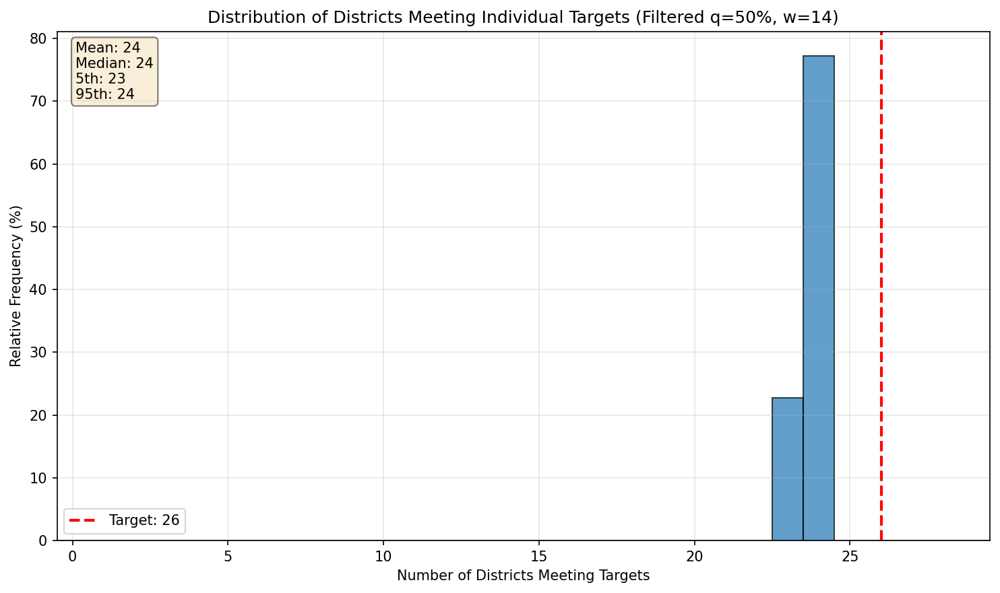
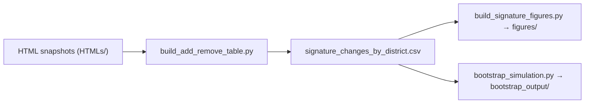

SignatureVNR Bootstrap
=======================

### Overview

This repository tracks petition signatures by State Senate district over time and uses a Monte Carlo bootstrap model to project final verified signature counts and the likelihood of meeting statutory targets.

The workflow is:

- **HTML snapshots → CSV**: Parse daily HTML snapshots of the Lt. Governor's verified signature table into a tidy per‑district add/remove table. (The HTML snapshots are locally scraped/stored, and not included in the GitHub repository)
- **Descriptive figures**: Visualize historical accumulation of signatures and removal rates across districts.
- **Bootstrap simulation**: Resample from the empirical add/remove distributions to simulate many possible futures and summarize the probability of success, both statewide and by district.

### Data pipeline

- **Inputs**
  - HTML snapshot files in `HTMLs/` named like `YYYY-MM-DD.html`.
  - Each HTML file contains a signer table with at least the columns `Voter ID` and `Senate District`.

- **From HTML to CSV (`build_add_remove_table.py`)**
  - `build_add_remove_table.py` reads all snapshot files in `HTMLs/`, ordered by date.
  - From the **first** date it computes initial per‑district counts of unique voter IDs and writes one row per district with:
    - `From_Date=""`, `To_Date=<first_date>`, `Senate_District`, `Added`, `Removed=0`.
  - For each **consecutive date pair** `(prev_date, curr_date)` it:
    - Finds voter IDs that appear only on the later date → counted as **Added** in the district shown on `curr_date`.
    - Finds voter IDs that disappear on the later date → counted as **Removed** from the district on `prev_date`.
  - It writes/appends one row per district and date transition to `signature_changes_by_district.csv` with columns:
    - `(From_Date, To_Date, Senate_District, Added, Removed)`.
  - Re‑running the script is idempotent over existing transitions: previously processed `(From_Date, To_Date)` pairs are skipped.

This CSV is the single, versionable data source that drives both the descriptive figures and the bootstrap simulation.

### Bootstrap sampling model

The bootstrap model implemented in `bootstrap_simulation.py` takes the historical add/remove patterns from `signature_changes_by_district.csv` and projects forward to estimate final counts and success probabilities.

#### Inputs and targets

- Reads `signature_changes_by_district.csv` and:
  - Derives **current per‑district counts** (`naive_counts`) by starting from initial rows and applying all subsequent `Added` and `Removed` transitions.
  - Builds empirical **daily addition pools** and **daily removal pools**:
    - `added_pools[district]`: all `Added` values from non‑initial transition rows for this district.
    - `removed_pools[district]`: historical `Removed` values, optionally filtered by a cutoff date so that only recent removals inform the removal distribution.
- Uses hard‑coded targets consistent with the project’s specification:
  - `DISTRICT_TARGETS`: required verified signatures for each Senate district (29 districts).
  - `STATEWIDE_TARGET`: total required signatures statewide.
  - `DISTRICTS_TARGET`: target number of districts that must individually meet their district‑level thresholds.

#### Construction of sampling pools

- **Naive mode** (`--mode naive`):
  - Uses the raw `added_pools` for each district.

- **Filtered mode (default)** (`--mode filtered`):
  - For each district, computes a filter threshold from the **last `filter_window` days** of activity (default: 14 days) using a specified quantile (default: median, `filter_quantile=0.5`).
  - Builds `filtered_pools[district]` by keeping only those `Added` values in the historical pool that are **greater than or equal to** the threshold.
  - If filtering would leave a district with an empty pool, it falls back to the unfiltered pool so that sampling is always well‑defined.

Filtered mode is intended to emphasize more recent and representative collection days when projecting forward, while still grounding the simulation in the empirical distribution.

#### Simulation timeline and phases

- **Simulation start date**
  - Defined as the latest `To_Date` appearing in the transition rows of `signature_changes_by_district.csv`.

- **Deadlines (defaults)**
  - **Verification deadline** (`--verification-deadline`): `2026-03-08`.
  - **Removal deadline** (`--removal-deadline`): `2026-04-22`.
  - **Removal eligibility window**: 45 days; signatures are only eligible for removal during the 45 days after they are verified.

- **Verification (additions) phase**
  - For each day from `start_date` through the verification deadline (inclusive), and for each district:
    - Draws one `Added` value with replacement from the chosen pool (naive or filtered).
    - Adds this value to the district’s running total.
    - Records the verification date and amount in a history used to calculate how many signatures are eligible for removal on later dates.

- **Removals phase** (can be disabled with `--no-removals`)
  - For each day from `start_date` through the removal deadline (inclusive), and for each district:
    - Computes the **removable pool**:
      - Sum of all additions whose verification date lies within the last 45 days (including the current day).
      - Capped by the current district total so that removals cannot exceed existing signatures.
    - Draws a `Removed` value with replacement from `removed_pools[district]`.
    - Caps the draw by the removable pool and subtracts it from the district’s running total.
  - This ensures that:
    - A removal on day *t* can only affect signatures verified in the recent 45‑day window.
    - District counts never go negative.

#### Aggregated outcomes

- The full simulation is repeated for `n_trials` Monte Carlo trials (default: `--trials 100000`).
- For each trial the script records:
  - The **final statewide total** of verified signatures.
  - The **number of districts** whose final counts meet or exceed their targets.
- Across all trials it then computes:
  - A distribution of statewide totals.
  - A distribution of the number of districts meeting their targets.
  - For each district, the **success probability**: the fraction of trials in which that district’s final count reaches its target.

These outputs summarize both **how likely the campaign is to succeed overall** and **which specific districts are more or less at risk**, under the assumption that future daily add/remove behavior looks like the empirical patterns captured so far.

#### Default configuration (as of this version)

All of the following defaults can be overridden with command‑line flags:

- **Mode**: `--mode filtered`.
- **Filter settings**:
  - `--filter-quantile 0.5` (median of recent days).
  - `--filter-window 14` (last 14 days of data per district).
- **Deadlines**:
  - `--verification-deadline 2026-03-08`.
  - `--removal-deadline 2026-04-22`.
- **Removal behavior**:
  - Removal eligibility window fixed at 45 days.
  - Removals enabled by default; use `--no-removals` to disable the removal phase and treat historical removals as already “baked in”.
- **Trials and output**:
  - `--trials 100000`.
  - `--output-dir bootstrap_output`.
  - `--format png` (PNG figures; `pdf` is also supported).

### Figures

This repository produces two families of figures:

1. **Historical signature figures** derived directly from `signature_changes_by_district.csv`.
2. **Bootstrap simulation figures** summarizing the Monte Carlo projections under the default configuration.

#### Historical signature figures (`build_signature_figures.py`)

Running:

```bash
python build_signature_figures.py --csv signature_changes_by_district.csv --out-dir figures
```

produces:

- Per‑district two‑panel plots (`figures/district_XX.png`):
  - **Top panel**: cumulative signatures over time for a single district.
  - **Bottom panel**: daily added and removed signatures as a side‑by‑side bar chart.
- An **overall** two‑panel plot aggregated across all districts:
  - Saved as `figures/overall.png`.
- A bar chart of **removal rate by district (and overall)**:
  - `removal_rate_pct = 100 * sum(Removed) / sum(Added)` for each district and overall.
  - Saved as `figures/removal_rate_by_district.png`.




#### Bootstrap simulation results (default configuration)

Running the bootstrap simulation with default parameters:

```bash
python bootstrap_simulation.py --csv signature_changes_by_district.csv --output-dir bootstrap_output
```

and leaving the mode as `filtered` (the default) produces figures whose filenames are prefixed with `filtered_q50_w14`, indicating:

- Filtered mode.
- 50th percentile (median) filter quantile.
- 14‑day filter window.

Key output figures include:

- **Parameter summary** (diagnostic)  
  

- **District success probability**  
  

- **Statewide total histogram**  
  

- **Number of districts meeting targets histogram**  
  

### Installation and setup

This project targets Python 3 and assumes you are working inside a local virtual environment at `.venv`.

1. **Create and activate a virtual environment**

   ```bash
   python -m venv .venv
   source .venv/bin/activate        # macOS / Linux
   # .venv\Scripts\activate         # Windows (PowerShell or CMD)
   ```

2. **Install Python dependencies**

   ```bash
   pip install -r requirements.txt
   ```

   The core dependencies are:

   - `lxml` for parsing HTML signer tables.
   - `pandas` for data manipulation.
   - `matplotlib` for plotting.

3. **Prepare input data**

   - Place daily HTML snapshots in `HTMLs/` with filenames like `YYYY-MM-DD.html`.
   - Ensure each file has a table containing `Voter ID` (first column) and `Senate District` (fourth column); other columns may exist but are ignored.

### Usage

#### 1. Build or update the per‑district add/remove table

```bash
python build_add_remove_table.py --html-dir HTMLs --csv signature_changes_by_district.csv
```

- Discovers all `YYYY-MM-DD.html` files in `HTMLs/`.
- Creates or updates `signature_changes_by_district.csv` with:
  - One initial row per district for the first date.
  - One row per district per consecutive date pair for added/removed counts.
- Skips transitions that are already present, so it is safe to re‑run as new HTML snapshots arrive.

#### 2. Generate historical signature figures

```bash
python build_signature_figures.py --csv signature_changes_by_district.csv --out-dir figures
```

- Writes per‑district two‑panel figures and `overall.png` into `figures/`.
- Writes `removal_rate_by_district.png` summarizing removal rates across districts and overall.

#### 3. Run the bootstrap simulation (default configuration)

```bash
python bootstrap_simulation.py --csv signature_changes_by_district.csv --output-dir bootstrap_output
```

- Uses:
  - Filtered mode with median threshold over the last 14 days.
  - Verification deadline `2026-03-08`.
  - Removal deadline `2026-04-22`.
  - 45‑day removal window.
  - 100,000 Monte Carlo trials.
- Writes diagnostic and outcome figures into `bootstrap_output/` with filenames starting `filtered_q50_w14_...`.

Commonly used options (run `python bootstrap_simulation.py --help` for the full list):

- `--trials`: number of Monte Carlo trials to run (default: `100000`).
- `--mode {naive,filtered}`: sampling mode for additions (default: `filtered`).
- `--filter-quantile`: quantile for the filter threshold (default: `0.5`).
- `--filter-window`: number of days used to compute the filter threshold (default: `14`).
- `--verification-deadline`: last date to simulate added signatures (default: `2026-03-08`).
- `--removal-deadline`: last date to simulate removals (default: `2026-04-22`).
- `--no-removals`: disable the removal phase and only apply historical removals from the CSV.
- `--output-dir`: directory where figures are written (default: `bootstrap_output`).
- `--format {png,pdf}`: output image format (default: `png`).

### Project structure

A high‑level view of the most important files and directories:

```text
SignatureVNRBootstrap/
├── HTMLs/                          # Daily HTML snapshots (input; not versioned here)
├── signature_changes_by_district.csv  # Generated per‑district add/remove table
├── build_add_remove_table.py       # Parse HTML snapshots into the CSV above
├── build_signature_figures.py      # Generate historical figures into figures/
├── bootstrap_simulation.py         # Monte Carlo bootstrap model and output figures
├── figures/                        # Historical figures (overall and per‑district)
│   ├── district_01.png
│   ├── ...
│   ├── overall.png
│   └── removal_rate_by_district.png
├── bootstrap_output/               # Bootstrap output figures for configured runs
│   └── ... 
├── requirements.txt                # Python dependencies
└── README.md                       # This document
```

### Analysis pipeline



